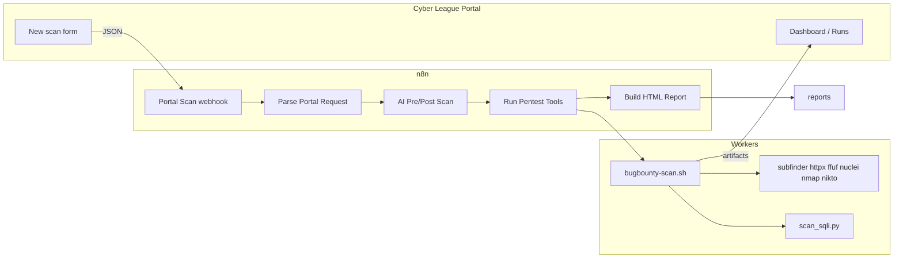

# Cyber League — Technical architecture

## System overview

Cyber League separates concerns into three layers:

| Layer | Role | Technology |
|-------|------|------------|
| **Portal** | UI: launch scans, view runs, delete data, configure scope | FastAPI, Jinja2, `127.0.0.1:8765` |
| **Engine** | Orchestration, branching, AI nodes, webhooks | **n8n** workflow `Bug Bounty Pentest Pipeline` |
| **Workers** | Tool execution, aggregation, guards | `bugbounty-scan.sh`, Python scripts |

The portal **never** shells out to scanners directly. It POSTs to n8n; n8n runs `bugbounty-scan.sh` via **Execute Command**.



## Technology stack

| Component | Choice | Rationale |
|-----------|--------|-----------|
| Orchestration | **n8n** | Visual workflow, webhooks, form triggers, Execute Command for shell workers |
| Portal | FastAPI + uvicorn | Lightweight local dashboard, no external DB |
| Workers | Bash + Python 3 | Fits Parrot/Kali toolchains; easy to extend |
| AI | OpenAI API (`gpt-4o-mini`) | Pre-scan prioritization, post-scan summary (optional) |
| Storage | Filesystem (`scans/`, `reports/`) | Simple artifacts for demos; no cloud dependency |
| Config | JSON sidecars, env files | `.current_scan_env`, `.current_scan_scope.json` |

## Data flow (one portal scan)

1. **User** submits target URL, preset, scope, and options on `/scan`.
2. **Portal** validates scope (`scope_utils.py`), writes sidecar files, POSTs payload to `http://localhost:5678/webhook/portal-scan` (fallback: n8n form trigger).
3. **Parse Portal Request** (n8n Code node) normalizes domain, `scan_config`, and `scope`; writes `.current_scan_domain` and `.current_scan_scope.json`.
4. **AI Pre-Scan** (optional) reads target context; may write `reports/ai_pre_scan.md`.
5. **Run Pentest Tools** runs:
   ```bash
   SCAN_PROFILE=light MAX_SUBDOMAIN_SCANS=5 SQLI_SCAN=1 ... \
   bash scripts/bugbounty-scan.sh $(cat .current_scan_domain)
   ```
6. **`bugbounty-scan.sh`** creates `scans/<domain>_<UTC>/`, runs light/deep phases, filters hosts by scope, runs `scan_sqli.py`, aggregates `vulnerabilities.json`.
7. **Parse Scan Result** + **Build HTML Report** produce `reports/bugbounty-report-*.html`.
8. **AI Post-Scan** (optional) merges findings into advisor output.
9. **Portal** lists runs from `scans/` and links reports.

## Scan phases (workers)

### Light

- Subdomain discovery (`subfinder`)
- Live host detection (`httpx`)
- Optional apex FFUF
- Security headers / TLS (`analyze_web_security.py`)
- Per-host scans (`scan_subdomains.py`) when enabled
- **SQL injection** (`scan_sqli.py`): nuclei `sqli` tags + safe error-based probes
- Scope filter on `hosts.txt` / `subdomains.txt`

### Deep

- Nmap (apex + NSE scripts)
- Nikto
- Nuclei (tagged templates, includes `sqli`)
- Reuses SQLi phase if light did not run

### Guards

- `rate_limit_guard.py`: delays, 403/block detection, `.scan_stop`
- `SCAN_MAX_RUNTIME_MINUTES`: optional cap

## AI integration

| Stage | Script / node | Input | Output |
|-------|---------------|-------|--------|
| Pre-scan | n8n + `ai_pentest_advisor.py` | Target, scope notes | `reports/ai_pre_scan.md` |
| Post-scan | Same | `vulnerabilities.json`, bundle | `reports/ai_post_scan.md`, merged HTML |

If `OPENAI_API_KEY` is missing, workflow continues without AI nodes failing the run.

## Known limitations

- **Linux-only** worker scripts; paths assume POSIX shell.
- n8n must be **Active**; DB patches require workflow toggle or restart after `patch_*.py`.
- Execute Command and Code `fs` require n8n env vars (documented in README).
- No multi-user auth on portal (local single operator).
- SQLi checks are **detection**, not full exploitation (manual validation required).
